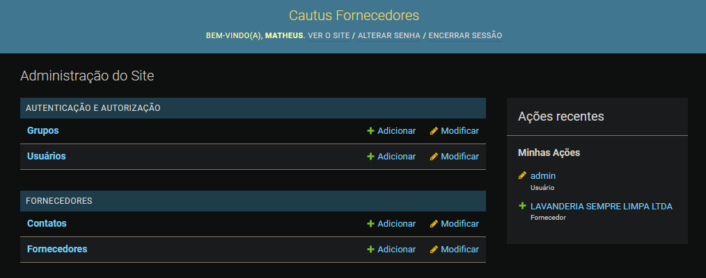

# Cautus - Gestão de Fornecedores

O objetivo desse projeto é demonstrar os conhecimentos necessários para ingressar no time da Cautus.

Este projeto tem como escopo a criação de um sistema de controle de fornecedores, tendo como requisitos que um Fornecedor seja composto por Razão Social, Endereço e Métodos de Contato (nome do contato e e-mail).

## Demonstração

No lugar das prints, conforme mencionado na avaliação, preferi realizar o deploy na PythonAnywhere para facilitar os testes.

Link para acesso: https://matheusdellan01.pythonanywhere.com/

Credenciais:
- Login: admin
- Senha: 123456

## Definição dos Models

- Fornecedores:
  - Razão Social: str (string)
  - Endereço: str
  - Contatos: Contato

- Contato:
  - Nome: str
  - Email: str

## Operações disponíveis

- Fornecedores e Contatos:
  - Criação
  - Edição
  - Exclusão
  - Busca

## Tecnologias Utilizadas

Como a avaliação poderia ser realizada em demais tecnologias além do asp.net e SQL Server, decidi usar o Python com o framework Django e usando o banco SQLite.

A escolha da tecnologia foi devida a maior comodidade com a linguagem Python e o framework Django, além disso, o Django possui várias ferramentas prontas "out-of-the-box", tais como o Django Admin, para facilitar as operações necessárias.

Já o SQLite foi utilizado por ser uma solução embedded, facilitando assim o teste local e replicação.

Além disso, escolhi a PythonAnywhere como plataforma de hospedagem por ser gratuita e de fácil utilização com o Django.

## Preparação do ambiente

É necessário o Python na versão 3.7+, sendo recomendada última versão estável (3.11)

É recomendável também a instalação do Poetry, para gestão das dependências, para isso:

1- Instale o Poetry:
`pip install poetry`

2- Navegue até a pasta da aplicação e digite:
`poetry install`

Caso queira fazer a instalação das dependências sem o poetry, também deixei o requirements.txt disponível, bastando digitar `pip install -r requirements.txt` na pasta do projeto

## Preparação da aplicação

1 - Navegue até a pasta "_cautus_" (a mesma onde se encontra o arquivo manage.py)

2 - Realize as migrações pendentes:

`python manage.py migrate`

3 - Crie seu usuário admin:

`python manage.py createsuperuser`

4 - Rode o servidor:

`python manage.py runserver`

## Utilizando a aplicação

Após realizar os passos acima você já pode usar livremente a aplicação, bastando acessar: `http://127.0.0.1:8000/`

## Imagens

### Página Inicial (Login):

### Página do Admin (Dashboard):

### Página de Listagem:

### Página de Criação:

### Página de Modificação:

### Remoção de Dados:

## Créditos

- Matheus Oliveira: theusontech@gmail.com
